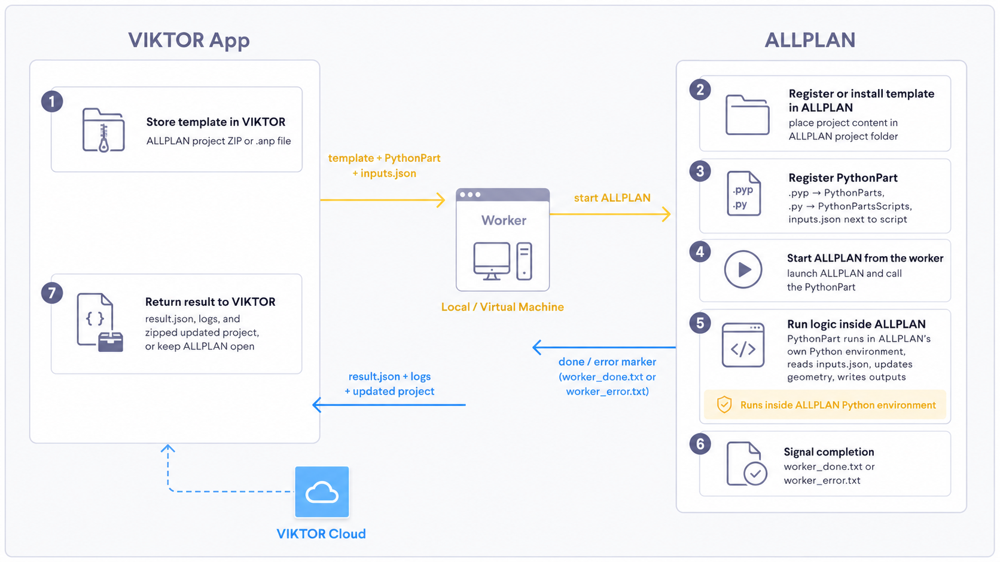
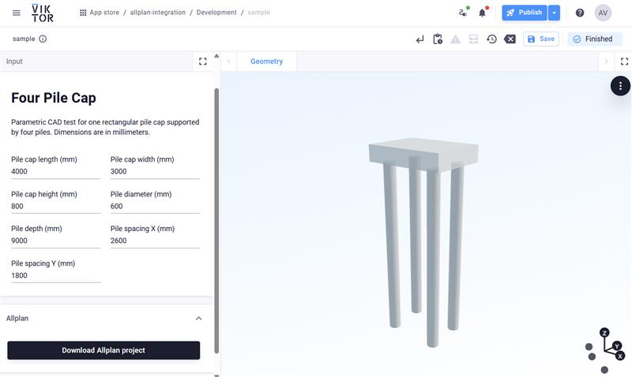
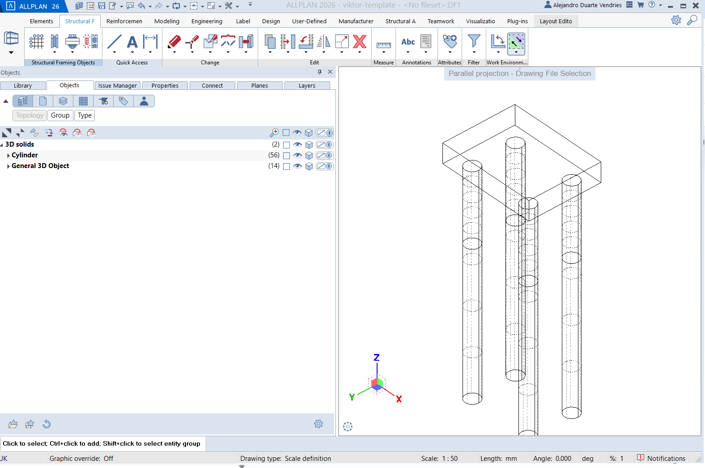

# ALLPLAN sample app

This repository contains the sample VIKTOR app for the ALLPLAN integration guide:
[ALLPLAN](https://docs-staging.viktor.ai/docs/create-apps/software-integrations/allplan/)

The app shows how to:

- prepare a VIKTOR app for an ALLPLAN worker integration
- send a template project, input data, and a PythonPart to the worker
- start ALLPLAN and execute the PythonPart inside ALLPLAN's Python environment
- collect the updated project and return it to VIKTOR as a download

## What this sample does

The sample app creates a simple four-pile pile cap model.

In VIKTOR, the user changes the pile cap dimensions and downloads an updated
ALLPLAN project. During that process, the worker:

- installs the template project in ALLPLAN
- registers the PythonPart files
- starts a new ALLPLAN process from the worker
- creates the pile cap geometry inside ALLPLAN
- waits for the PythonPart completion marker
- zips the updated project and returns it to VIKTOR

## Automation flow



## VIKTOR app



## ALLPLAN result



## Template project note

The file `app/worker/viktor-template.prj.zip` should be a ZIP export of an
empty ALLPLAN project.

That template project should already be valid and registered in ALLPLAN before
you package it as the sample input project. The worker installs that project
into the ALLPLAN projects folder and uses it as the starting point for the
automation run.

Current limitation: the sample assumes the ZIP contains a project structure
that ALLPLAN can open directly as `viktor-template.prj`. If the ZIP was created
from an invalid, incomplete, or differently named project, the worker install
step will not produce a usable project.

## App structure

```text
viktor-allplan-integration/
├── app/
│   ├── __init__.py
│   ├── app.py
│   └── worker/
│       ├── run_allplan_model.py
│       ├── PileCapWorker.pyp
│       ├── PileCapWorker.py
│       └── viktor-template.prj.zip
├── viktor.config.toml
├── requirements.txt
└── README.md
```

## Run the sample

From the repository root:

```powershell
viktor-cli start
```
